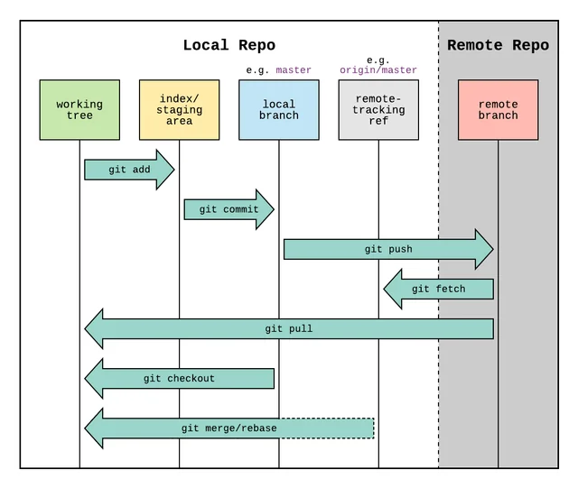

# Version Control your Code

### Learning Git and GitHub

## Why you should learn Git and Github

Git tracks every change you make, allowing you to go back to a previous version of your code, similar to version control in word. GitHub is a
cloud-based platform for hosting Git repositories, makes it simple to collaborate with others. Using features like
branches, you can work on different parts of a project independently, then merge changes. Using Git you will never have to worry about your code getting deleted.

## General Git workflow

```
            Start tracking Git history for a directory (folder)
            git init

            Fetch and merge changes from the remote repository
            git pull

            Check the status of your files
            git status

            Stage the files you want to commit (you can specify files or use . for all changes)
            git add .

            Commit your changes with a descriptive message
            git commit -m "Describe what you changed or added"

            Push your commits to the remote repository
            git push
```

## 4 Levels of Version Control

### Getting Started with GitHub

GitHub GUI is great for 90% of what you'll be using Git for. Let's start with the basics:

- Create a [GitHub account](https://github.com/)
- Download [GitHub
  Desktop](https://github.com/apps/desktop)
- Download [Git](https://git-scm.com/downloads)
- Complete the GitHub tutorial

### 2 Main Paths When Starting a New Project

#### Option 1: Clone Someone Else's Repository

To clone someone else's repository from GitHub:

- Copy the link to the repo
- Click File > Clone Repository in GitHub Desktop
- Paste the link and choose where you want to copy the Repository locally

#### Option 2: Make Your Own Repository

To make your own version-controlled repository:

- Click File > New Repository in GitHub Desktop
- Give your repository a name and description
- Choose a local path
- Click "Create Repository"

The main point of Git is to version control your code and collaborate with others like Google Docs.

💾

#### Committing

Saving changes locally with messages

☁️

#### Pushing

Transferring changes to GitHub

⬇️

#### Pulling

Getting others' changes locally

[Learn
more](https://gist.github.com/ZoeKHarvey/96cc58d782df8ea1ee5cf4117e66282a)


## Working with Branches

The next level of working in Git would be to start using branches in Git. A branch is basically a copy of
a repository that you can use to try out changes to your code before adding them to your main code.

### Creating and Using Branches

1. In GitHub Desktop, click "Branch" in the top menu
2. Select "New Branch" and give it a name
3. Make your changes in this branch
4. Commit the changes to the branch
5. Push the branch to GitHub

Once the changes you make to the new branch look good, you can merge those changes into your main branch.
This is especially useful when you are working with other people and each want to make changes to code
and then combine them together.

### Pulling changes from a feature branch into the main branch

1. Create a new branch
2. Commit changes to a branch
3. Push changes to GitHub
4. Merge a branch into main using a Pull Request
## Advanced Git Features

At this point, you understand the basics of Git, and the scale of the projects you work on are becoming
very large. There are some advanced tips that you should start to use to stay organized.

### Advanced Features

#### .gitignore

A file that tells Git what files to not track. This would include data and passwords you do not want
on GitHub.

More information on gitignore: [Link](https://www.freecodecamp.org/news/gitignore-what-is-it-and-how-to-add-to-repo/)

#### Rebasing vs. Merging

Rebasing is preferred over merging because it keeps a linear commit history of all the changes, so
when you want to go back to a previous change, it is easier to see what change happened in what
order.

More information on merging vs rebasing: [Link](https://www.atlassian.com/git/tutorials/merging-vs-rebasing)

#### Squashing commits

When you want to rebase 2 branches it is super useful to squash (combined) as many commits as you can
together. Rebasing works by reapplying commits on top of a new base commit, so basically takes the
commits from branch B and stacks them onto branch A. This is a lot easier if you have fewer commits,
and it also makes it easier for you later on when you want to look at your commit history and see
what you did before.

More Information on Squashing Commits: [Link](https://www.git-tower.com/learn/git/faq/git-squash)

#### Use Git in the Terminal

Using Git in the terminal is great because you never have to leave your code editor to make changes
to your code, as well as opens up a bunch of advanced features that are a bit harder using GitHub
Desktop.

A useful tool for using git in the command line is [lazygit](https://www.freecodecamp.org/news/how-to-use-lazygit-to-improve-your-git-workflow/) allowing you to use keyboard shortcuts instead of typing out entire git command.
## Continuous Development using Git

Once you start getting into the software side of coding, it is super useful to use advanced Git workflows
and automation.

### Professional Git Tools

#### Pre-commit Hooks

Use [pre-commit](https://pre-commit.com/) to ensure that all code changes
are consistent in style, free of common mistakes, and do not include anything unintended before they
are committed to your repository.

**Pre-commit** is a framework for managing and maintaining multi-language pre-commit
hooks. These hooks run automatically before each commit and can catch issues like formatting errors,
unused imports, and more.

You need to install and configure pre-commit in each repository you want it to run in.
To do this, install the tool globally with pip install pre-commit, add a
.pre-commit-config.yaml file to your repository, and run
pre-commit install to activate it for the repo.

Once set up, the hooks will run automatically every time you make a commit, helping enforce code
quality and consistency across your project.

#### Pull Requests

Another advanced feature is to use pull requests in GitHub so that before anyone can add changes to
your main branch, you can make sure that certain code requirements are met beforehand.

1. Create a branch with your changes
2. Push the branch to GitHub
3. Go to the repository on GitHub and click "New pull request"
4. Select your branch to merge into main
5. Add reviewers and description
6. Create the pull request

#### GitHub Actions

[GitHub Actions](https://docs.github.com/en/actions/about-github-actions/understanding-github-actions) are automated actions that occur after a certain event.
GitHub actions go along with pull requests and are used to run tests prior to merging a branch.

[Back to Top](#)
