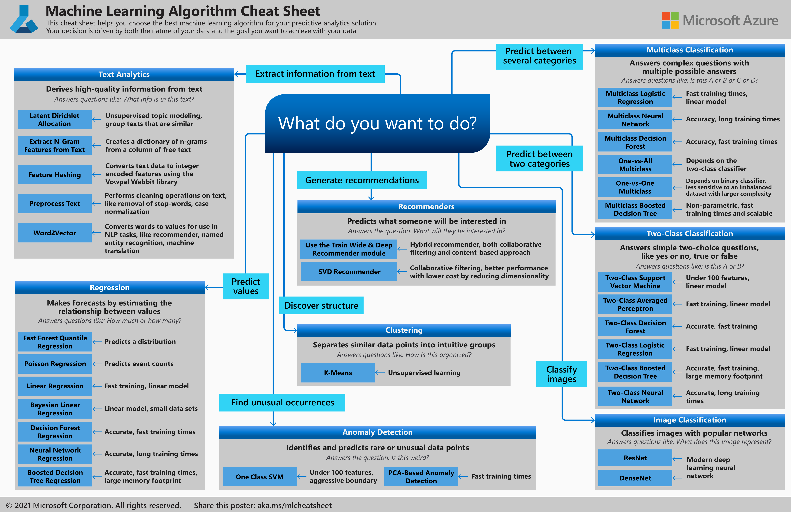

# Tools for Machine Learning in Python

*Scikit-Learn, Tensorflow, Pytorch*

### Scikit-Learn

Scikit-Learn is great for traditional machine learning tasks like classification, regression, clustering, etc.

A good starting place would be getting comfortable with NumPy, Pandas, and Matplotlib in Python so that you can
clean your data into features and target. After that learn the different ML algorithms and when to use them.

### Tidymodels

TidyModels is similar to Scikit learn but in R and uses tidyverse principles.
Read more about it [here](https://www.tidymodels.org/start/models/).

### Types of Machine Learning Algorithms

- **Supervised Learning**
  - Classification: Logistic Regression, Decision Trees, Support Vector Machines (SVM)
  - Regression: Linear Regression, Random Forest Regressor, Gradient Boosting
- **Unsupervised Learning**
  - Clustering: K-Means Clustering, Hierarchical Clustering
  - Dimensionality Reduction: Principal Component Analysis (PCA)
- **Reinforced Learning**
  - Large Language Models

### Data Splitting

Divide your data into the following subsets:

- **Training Data:** Used for model development.
- **Validation Data:** Used for tuning model parameters and preventing overfitting.
- **Testing Data:** Used for evaluating the final model's performance on unseen data.

### Choose What ML Algorithm Is Right For You

[source](https://learn.microsoft.com/en-us/azure/machine-learning/algorithm-cheat-sheet?view=azureml-api-1)

### Neural Networks

Neural Networks are used for deep learning and are fairly advanced. The 2 widely used deep learning frameworks
are PyTorch and Tensorflow

### Basic Hyperparameters in Neural Networks

- **Learning Rate:** Controls how quickly the model updates its weights.
  - Too high – the model may overshoot and fail to converge (it bounces around).
  - Too low – the model converges very slowly and may get stuck in local minima.
- **Batch Size:** Number of training examples used in one update of model weights.
  - **Stochastic Gradient Descent (SGD):** Batch size = 1
  - **Mini-batch SGD:** Batch size > 1 but smaller than the full dataset
  - **Full-batch:** Entire dataset used (rare due to memory constraints)
- **Epoch:** One complete pass through the entire training dataset.
  - Example: 1,000 samples / batch size 100 = 10 iterations per epoch

Josh Starmer has a great course on YouTube that walks you through principles of machine learning [here](https://www.youtube.com/playlist?list=PLblh5JKOoLUICTaGLRoHQDuF_7q2GfuJF).

[Back to Top](#)
